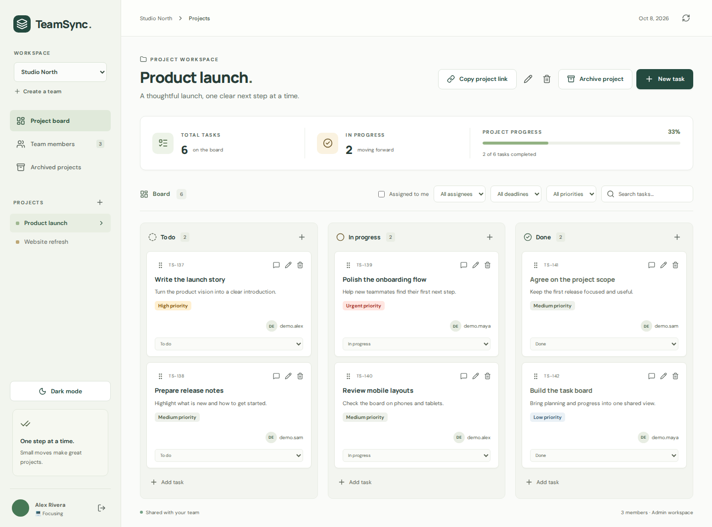
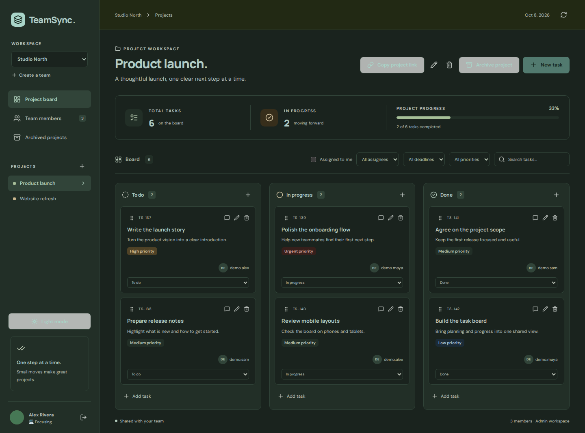
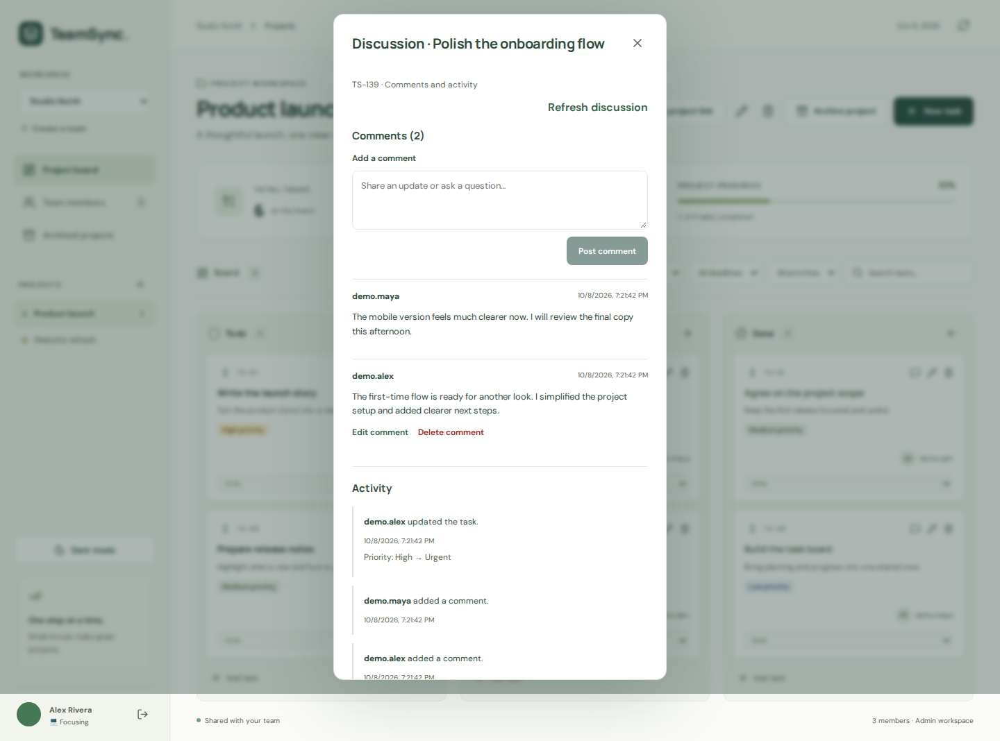
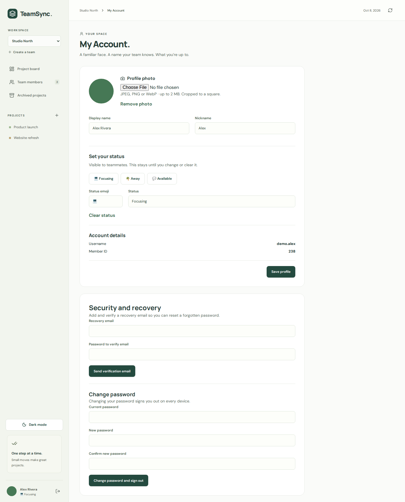
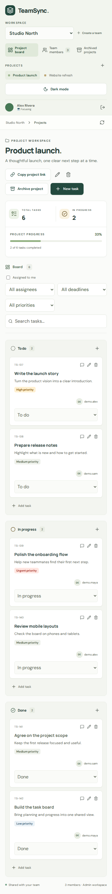
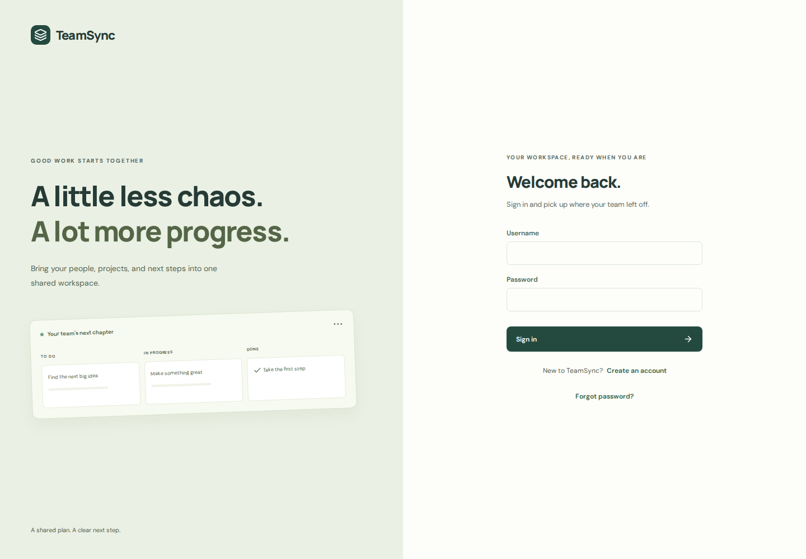

# TeamSync

**A little less chaos. A lot more progress.**

TeamSync brings projects, tasks, and conversations into one shared workspace.
Plan work on a Kanban board, invite teammates, and keep track of what is moving
forward.

[Open the live app](https://team-sync-omega-ruby.vercel.app/) ·
[Feature guide](docs/FEATURES.md) ·
[Deployment guide](docs/VERCEL_RENDER.md) ·
[Roadmap](docs/ROADMAP.md)



## What you can do

- **Organize work:** create teams and projects, assign tasks, set deadlines and
  priorities, and move tasks through To do → In progress → Done. Desktop drag and
  drop and touch-friendly status menus are supported.
- **Find your next step:** combine search, assignee, deadline, and priority
  filters, or focus on tasks assigned to you.
- **Work together:** share single-use invitation links, manage admin/member
  roles, and discuss tasks with editable comments and activity history.
- **Keep completed work:** archive projects as read-only boards and restore
  them when needed.
- **Make it yours:** switch between light and dark themes; edit your display
  name, nickname, profile photo, and emoji/text status in My Account.
- **Share a project:** copy its link and return to the same board after sign-in
  or a refresh. Links follow the team's access permissions.
- **Manage account access:** change passwords and sign out with server-side
  session revocation. Verified email recovery is supported when an email
  provider is configured.

## A closer look

Screenshots come from the actual app using fictional demo data in a separate
local test database. No demo accounts or projects are added during normal setup.

<details>
<summary>Dark mode</summary>



</details>

<details>
<summary>Task discussion and activity</summary>



</details>

<details>
<summary>My Account</summary>



</details>

<details>
<summary>Mobile board</summary>



</details>

<details>
<summary>Sign-in screen</summary>



</details>

## Built with

| Layer | Technology |
| --- | --- |
| Frontend | React, TypeScript, Vite, CSS, Lucide icons |
| Backend | Django, Django REST Framework, SimpleJWT |
| Database | SQLite locally; PostgreSQL for deployment |
| Application server | Gunicorn and WhiteNoise |
| Tests | Django test runner, Vitest, Testing Library, Playwright, axe-core |
| Hosting | Vercel frontend; Render API and PostgreSQL |
| Recovery email | Resend over HTTPS when enabled; private email files locally |

Dependencies and lockfiles are committed. Use **Python 3.12+** and **Node.js 24+**.

## Run locally

Clone the repository and enter it:

```sh
git clone https://github.com/VedantBandre/TeamSync.git
cd TeamSync
```

Start the backend from the repository root:

```sh
python3.12 -m venv backend/venv
backend/venv/bin/python -m pip install -r backend/requirements.txt
backend/venv/bin/python backend/manage.py migrate
backend/venv/bin/python backend/manage.py runserver 127.0.0.1:8000
```

In a second terminal, also from the repository root:

```sh
npm --prefix frontend ci
npm --prefix frontend run dev
```

Open **http://127.0.0.1:5173/**. Create an account, sign in, then create your first
team and project. The frontend forwards `/api` requests to Django on port 8000.
Local setup needs no environment file and stores data in `backend/db.sqlite3`.

For optional Django admin access:

```sh
backend/venv/bin/python backend/manage.py createsuperuser
```

The admin is at `http://127.0.0.1:8000/admin/`. Local verification/reset emails
are saved as private MIME files under `backend/.emails/`, which is ignored by Git.
See the [feature guide](docs/FEATURES.md#account-security-and-recovery) for recovery
behavior.

## Deployment and current status

The frontend is deployed on Vercel and the Django API on Render. The live core
workflow was checked in a browser: registration/sign-in, teams, projects, task
updates, comments, profiles, password changes, and logout. Mobile layout checks
covered widths down to 320 pixels.

**Live email recovery is currently disabled** because a Resend sender and API key
have not been configured. Password changes work independently of email.

The checked-in Render Blueprint selects free API and database plans. Render's
free API sleeps after 15 minutes of inactivity, so the first request can take
about a minute. Its free PostgreSQL database expires after 30 days and has no
managed backups. This deployment is a demo; retaining data beyond that limit
needs a separately configured database. See [Render's free service limits](https://render.com/docs/free).

For the existing frontend-only Vercel deployment, use root directory `frontend`
and set this build-time environment variable:

```env
VITE_API_BASE_URL=https://teamsync-api-skxf.onrender.com/api
```

Redeploy after changing it. The API must allow the exact frontend origin through
`DJANGO_CORS_ALLOWED_ORIGINS`. The Vite development proxy does not run on Vercel.

The [Vercel/Render setup guide](docs/VERCEL_RENDER.md) covers secrets, database
connections, migrations, health checks, and enabling Resend. The
[production settings guide](docs/DEPLOYMENT.md) explains the environment contract.
Django reads process environment variables; it does not automatically load `.env`.

## API and permissions

The API accepts JSON. Protected routes require
`Authorization: Bearer <access-token>`.

| Routes | Purpose |
| --- | --- |
| `/api/register/`, `/api/token/`, `/api/token/refresh/` | Registration and authentication |
| `/api/me/`, `/api/logout/`, `/api/password/change/` | Profile and account access |
| `/api/organizations/`, `/api/memberships/` | Teams and membership management |
| `/api/projects/`, `/api/tasks/` | Projects and task boards |
| `/api/tasks/<id>/comments/`, `/api/tasks/<id>/activity/` | Discussion and history |
| `/api/invitations/`, `/api/invitations/preview/`, `/api/invitations/accept/` | Invitation links |
| `/api/projects/<id>/archive/`, `/api/projects/<id>/restore/` | Project archiving |
| `/api/email/verify/request/`, `/api/email/verify/confirm/` | Recovery email verification |
| `/api/password/reset/request/`, `/api/password/reset/confirm/` | Password reset |
| `/health/` | API/database readiness |

Any registered user can create a team and becomes its first admin. Members can
work on tasks and post comments; admins also manage projects, invitations, and
membership. Users can edit/delete only their own comments. The last admin cannot
be removed or demoted. Archived projects are read-only until an admin restores
them. Team isolation is enforced by the backend, including shared project links.

Access and refresh tokens are held in the current tab's session storage. Logout
revokes that login session; password changes/resets revoke every session for the
account. Recovery links are single-use and expire after one hour. Invitation
links admit one member and expire after seven days. See the
[feature guide](docs/FEATURES.md) for more detail on behavior and API operations.

## Checks

From the repository root:

```sh
backend/venv/bin/python backend/manage.py check
backend/venv/bin/python backend/manage.py makemigrations --check --dry-run
backend/venv/bin/python backend/manage.py test accounts organizations projects tasks config
npm --prefix frontend run format:check
npm --prefix frontend run lint
npm --prefix frontend test
npm --prefix frontend run build
```

For browser tests:

```sh
cd frontend
npx playwright install chromium
npm run test:e2e
```

Browser tests use ports **8001/5174** and `backend/.e2e.sqlite3`, separate from the
normal development servers and database. Set `TEAMSYNC_PYTHON` if your Python
environment is outside `backend/venv`. Failure screenshots/traces are saved to
`frontend/test-results/` and excluded from Git.

GitHub Actions runs frontend formatting, lint, component tests, builds, and
browser tests on desktop and mobile. Backend checks run on SQLite and PostgreSQL.

## Repository and development workflow

```text
backend/               Django apps, migrations, settings, deployment scripts
frontend/              React app, component tests, browser tests
docs/                  Feature, deployment, and roadmap guides; screenshots
.github/workflows/     Frontend and backend CI
render.yaml            Free Render API/database Blueprint
vercel.json            Configuration for repository-root frontend deployment
```

Start from updated `main`. Use `dev/<topic>` for features and `fix/<topic>` for
focused fixes, run relevant checks, and open a pull request into `main`.
Apply migrations after pulling backend changes. Keep the normal local frontend
and backend running after PR work; browser tests manage their own isolated
servers. Keep secrets, email files, and local databases out of commits.

Next priorities are enabling live recovery email, choosing a longer-lived free
database, and adding pagination/server-side filters for larger workspaces.
See the [roadmap](docs/ROADMAP.md) for the remaining work.
